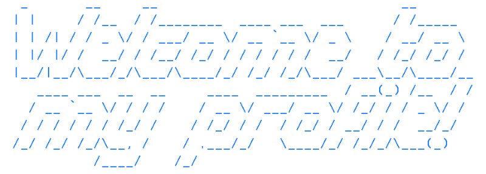

<div align="center"></div>


## My activity 🎴


## Coding activity 💻

<!--START_SECTION:waka-->

```txt
Total Time: 166 hrs 32 mins

Python                             99 hrs 57 mins        ⣿⣿⣿⣿⣿⣿⣿⣿⣿⣿⣿⣿⣿⣿⣿⣀⣀⣀⣀⣀⣀⣀⣀⣀⣀   59.88 %
Rust                               28 hrs 31 mins        ⣿⣿⣿⣿⣤⣀⣀⣀⣀⣀⣀⣀⣀⣀⣀⣀⣀⣀⣀⣀⣀⣀⣀⣀⣀   17.09 %
Java                               11 hrs 56 mins        ⣿⣷⣀⣀⣀⣀⣀⣀⣀⣀⣀⣀⣀⣀⣀⣀⣀⣀⣀⣀⣀⣀⣀⣀⣀   07.15 %
Go                                 6 hrs 10 mins         ⣿⣀⣀⣀⣀⣀⣀⣀⣀⣀⣀⣀⣀⣀⣀⣀⣀⣀⣀⣀⣀⣀⣀⣀⣀   03.70 %
YAML                               2 hrs 52 mins         ⣦⣀⣀⣀⣀⣀⣀⣀⣀⣀⣀⣀⣀⣀⣀⣀⣀⣀⣀⣀⣀⣀⣀⣀⣀   01.72 %
```

<!--END_SECTION:waka-->


